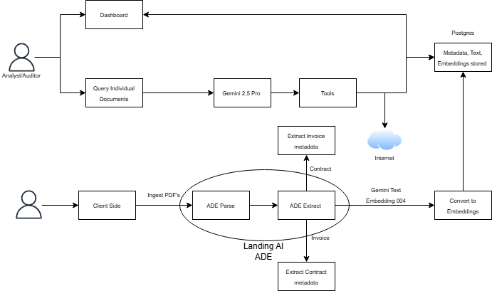

# DocuFlow Frontend

[](https://www.youtube.com/watch?v=VeF_WH0lBcg)
[](https://docs.google.com/presentation/d/1-4UzFsEGc-YEsawkF1TZr6JJp8wF3YZD3iYsPQI4PLo/edit?usp=sharing)

DocuFlow is the intelligence layer for finance teams who live inside PDFs. Built with Vite, React, and TypeScript, the frontend turns raw invoices and contracts into auditor-ready insights, pairing real-time analytics with conversational AI so analysts can move from ingestion to investigation without leaving the browser.

---

## Problem Clarity & Domain Relevance

- **Focused pain point:** Finance teams drown in unstructured PDFs; DocuFlow centralises upload, validation, and AI-assisted review for invoices and contracts.  
- **Regulated workflows:** Language, badges, and role-tailored dashboards mirror audit, compliance, and advisory responsibilities for auditors, chartered accountants, compliance officers, and consultants.  
- **Live data hooks:** The frontend binds directly to the FastAPI pipeline, surfacing ADE extraction, Gemini embeddings, and Postgres storage health so reviewers understand document lineage.

## Depth of ADE Integration & Technical Implementation

- **ADE-first pipeline:** `UploadForm` sends PDFs through Landing AI ADE Parse/Extract before invoking Gemini Text Embedding 004 and syncing to Postgres. Status states render in `DashboardCards` and workflow summaries.  
- **Typed gateway:** `src/api/index.ts` encapsulates ADE and Gemini requests with TypeScript guards, ensuring the UI only renders validated payloads.  
- **Visual traceability:** The architecture diagram (below) reflects the exact ADE loop plus Gemini enrichment, while inline badges report extraction state per document.

## Accuracy, Reliability & Performance

- **Metadata fidelity:** `InvoiceList`, `ContractList`, and `DetailsModal` display ADE-generated metadata with timestamps, seller/vendor identifiers, and extraction summaries.  
- **Health monitoring:** API health polling (30-second cadence) surfaces degraded or offline states with color-coded badges and fallbacks.  
- **Error resilience:** Upload validation, toast notifications, and retry flows guard against malformed PDFs or network interruptions; optimistic UI keeps users informed without hiding failures.

## Usability & Workflow Design

- **Role-aware onboarding:** `RoleSelection` maps users to tailored dashboard messaging, with “Coming Soon” indicators for future personas.  
- **AI in-context:** `AIChatPanel` anchors Gemini 2.5 Pro responses to selected invoices/contracts, providing jump links to tables and workflow summaries.  
- **Actionable dashboards:** KPI cards, recent upload feeds, SLA panels, and workflow guidance combine to guide analysts from ingestion to exception handling in a single view.

## Real-World Feasibility & 90-Day Pilot Path

- **Deployment-ready stack:** Vite + React + Tailwind builds into a static bundle deployable on Cloudflare Pages, Vercel, or S3/CloudFront.  
- **Configurable integrations:** `.env` variables switch API backends; ADE endpoints and Gemini keys can be rotated without code changes.  
- **Pilot roadmap:** Week 0–2 environment setup; week 3–6 targeted pilot with two finance personas; week 7–9 expand to compliance plus production hardening (monitoring, RBAC, audit logs).

## Presentation & Demo Assets
- **Product demo:** Watch the narrated walkthrough covering upload, ADE extraction, and AI insights.
- **Pitch deck:** Review the complementary slide narrative covering problem statement, architecture, and pilot milestones.

## What It Solves

- **Accelerates audit readiness** — Dashboard cards, exception heatmaps, and inline AI summaries surface the “so what?” behind every upload.  
- **Keeps AI in the workflow** — Gemini 2.5 Pro powers contextual chat, inline Q&A, and tailored prompts tied to each document row. No context switching, no copy/paste gymnastics.  
- **Shows the end-to-end pipeline** — Users see progress from ingestion through ADE Parse/Extract and embedding generation, mirroring the production data path so stakeholders trust the automation.  
- **Ships with a composable design system** — The shadcn-inspired component library (`src/components/ui`) keeps the experience consistent, accessible, and easy to white-label.

---

## Architecture Snapshot

The frontend orchestrates three core lanes that mirror the system diagram shared above:

1. **Analyst Command Surface**  
   - `Dashboard` page aggregates cross-document KPIs, processing status, and AI nudges.  
   - `Reports` page layers analytics, time-series trends, and exportable compliance checklists.

2. **Document Intelligence Pipeline**  
   - `Upload` page funnels PDFs into the Landing AI ADE flow (Parse ➜ Extract ➜ Gemini embeddings).  
   - `Invoices` and `Contracts` pages render normalized metadata, with inline AI queries per row.  
   - `AIChatPanel` stitches Gemini responses to specific documents using the anchoring metadata stored in Postgres.

3. **Platform Services**  
   - `src/api/index.ts` provides typed gateways for the FastAPI backend (`/upload_document`, `/invoices`, `/contracts`, `/ai/query`, `/health`).  
   - Shared type guards live in `src/types`, ensuring the UI trusts every payload before rendering.

> **Data flow recap:** Client uploads ➜ Landing AI ADE Parse ➜ ADE Extract ➜ Gemini Embedding 004 ➜ Embeddings stored in Postgres ➜ Gemini 2.5 Pro serves conversational answers back to the Dashboard and row-level AI buttons. The UI reflects each phase with optimistic status badges and retry affordances.



---

## Component Playbook

| Area | Key Components | Highlights |
| --- | --- | --- |
| Global Shell | `layout/AppLayout`, `layout/Sidebar`, `layout/TopNav`, `ThemeToggle` | Responsive nav, role-aware quick links, persistent dark/light theming |
| Dashboard Intelligence | `DashboardCards`, `InlineQueryCell`, `AIChatPanel` | KPI tiles, inline AI suggestions, real-time Gemini follow-ups |
| Document Tables | `InvoiceList`, `ContractList`, `DetailsModal` | Virtualized tables, hover affordances for AI actions, JSON deep-dive modal |
| Upload Experience | `UploadForm` | Multi-step validation, progress feedback, success handoff to tables and AI |
| Role Onboarding | `RoleSelection` | Persona-specific defaults for auditors, compliance officers, finance leads |
| UI Primitives | `components/ui/*` | Button, Card, Dialog, Progress, Select, etc. — all Tailwind-powered, accessible, and themable |

Every component is co-located with its styles via Tailwind utility classes. Shared transitions and color tokens live in `src/index.css`, ensuring the experience feels bespoke while remaining easy to maintain.

---

## Getting Started

### Prerequisites

- **Node.js** ≥ 20.x and **npm** ≥ 10.x (`node -v`, `npm -v`)  
- FastAPI backend for DocuFlow running on `http://localhost:8001`

### Install & Run

```bash
git clone https://github.com/aws-financial-ai-hack-skywalkers77/client-side.git
cd client-side/document-processing-client
npm install
npm run dev
```

- Dev server launches at `http://localhost:5173` and pings `/health` every 30 seconds.
- Build with `npm run build`; preview production bundle via `npm run preview`.

### Environment Variables

The frontend reads Vite envs prefixed with `VITE_`. The starter `.env` contains:

```
VITE_API_BASE_URL=http://localhost:8001
```

Create additional variants (`.env.staging`, `.env.production`) as you promote through environments. Vite merges mode-specific files automatically.

---

## Project Structure

```
src/
 ├─ api/                # Axios instance, REST helpers, and workflow-specific actions
 ├─ components/         # Feature + UI primitives (grouped by domain)
 │   ├─ layout/         # Application shell, navigation, theming
 │   └─ ui/             # Design-system foundation (shadcn-inspired)
 ├─ context/            # Global providers (theme, query cache hooks if introduced later)
 ├─ pages/              # Route-level views (Dashboard, Upload, Invoices, Contracts, Reports, Settings)
 ├─ types/              # Shared DTOs for invoices, contracts, ADE status, AI responses
 └─ main.tsx            # App bootstrap with router + theme provider
```

Supporting configuration lives in:

- `tailwind.config.cjs` — design tokens, animations, and content scanning  
- `tsconfig.json` — path aliases (`@/components`, `@/api`, etc.)  
- `vite.config.ts` — dev server proxying, build optimizations, and React plugin setup

---

## Development Workflow

- **Type-safe APIs:** Update `src/types` first, then adapt `src/api/index.ts` and the consuming components.  
- **Design polish:** Use `components/ui` primitives to ensure consistent spacing, color, and motion.  
- **AI Iterations:** `AIChatPanel` exposes a single `submitPrompt` helper—extend prompts there to add new “Ask DocuFlow” shortcuts.  
- **Testing hooks:** While formal tests aren’t shipped yet, the architecture is ready for React Testing Library + MSW; seed stories or tests under `src/__tests__` as you scale.  
- **Build & Deploy:** Run `npm run build` to produce the `dist/` bundle. Deploy via any static host (Cloudflare Pages, Vercel, S3 + CloudFront). Configure `VITE_API_BASE_URL` per environment.

---

## Operational Checklist

- Monitor FastAPI `/health` to keep the UI badge green.  
- Ensure ADE Parse/Extract services and Gemini endpoints are reachable; the UI surfaces toast errors and queue retry buttons when not.  
- Verify Postgres embeddings table migrations whenever the ADE schema evolves; the frontend expects enriched metadata for Invoice/Contract details and AI anchoring.

---

## License & Credits

DocuFlow belongs to the `aws-financial-ai-hack-skywalkers77` initiative. Confirm licensing for external distribution.  
Design system inspired by shadcn/ui. AI experiences built on Google Gemini, Landing AI ADE, and DocuFlow’s custom prompt orchestration.
